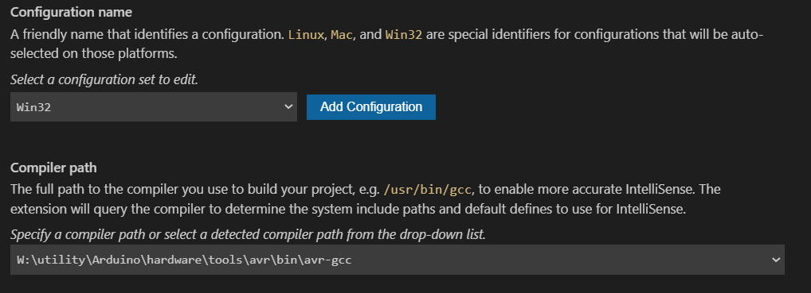
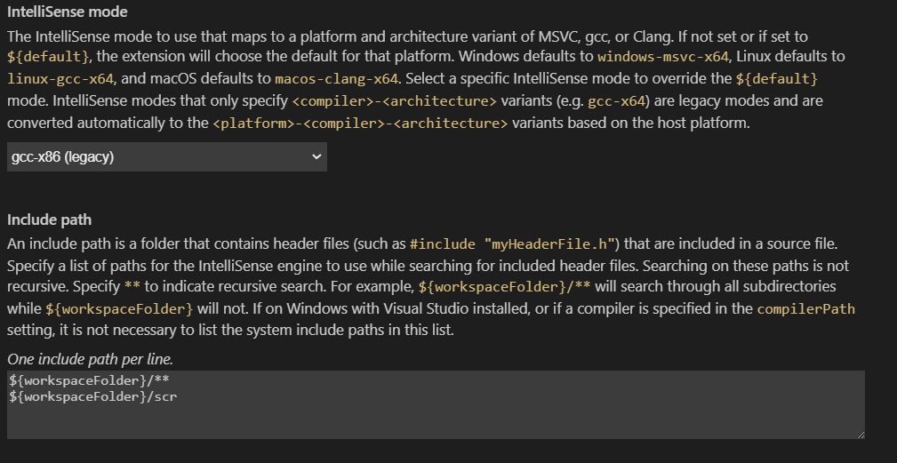

# P000-504
Dynamixel AX-18A Servo motor drive with atmega328P

# Summery
This project is created to investigate the feasibiliy of using atmega328p microcontroller to control the Dynemixel AX-18A servo motor

# Build Information

* Install Visual studio code (VS code) [Click here](https://code.visualstudio.com/download)
* Copy utility folder to the W drive (download utility folder here : [utility](https://code.visualstudio.com/download)) 
* Add following path to the environment variable
```
W:\utility\Arduino\hardware\tools\avr\bin
```
* Open project folder using VS code 
* Use Terminal -> Run Task to compile and upload the code to microcontroller

# Build from scratch

* Use this procedure if .vscode folder dose not appear in your project file
* Download utility folder from here [utility](https://code.visualstudio.com/download)
* Copy and paste utility folder in W drive (W:\utility)
* Open project folder using VS code
* Press F1
* Select "C/C++: Edit configurations (UI)"
* Place the following path as the compiler path
```
W:\utility\Arduino\hardware\tools\avr\bin\avr-gcc
```



* Use "gcc-x86(legacy)" as iltelliSensce mode
* Place "${workspaceFolder}/scr" in include path



* Add task.json file to .vscode folder to specify the build task
* Build the project by clicking Terminal -> Run Task
* For more details [Click here](https://www.instructables.com/Programming-AVR-Chips-Using-Visual-Studio-Code/)
